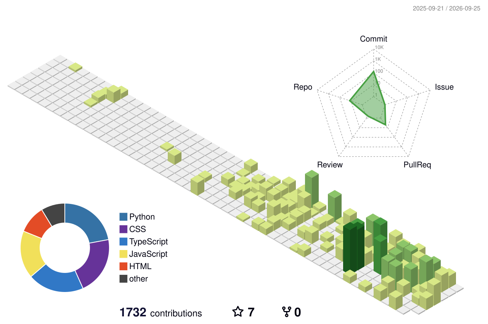

<!-- ══════════════════ HEADER ══════════════════ -->

  

<!-- ══════════════════ TYPING ══════════════════ -->

  

<!-- ══════════════════ LINKS ══════════════════ -->

  
  
  

 

<!-- ══════════════════ STATS ══════════════════ -->
<h3 align="center">📈 A Look at My Year</h3>

  <picture>
    <source media="(prefers-color-scheme: dark)" srcset="https://github-readme-streak-stats.herokuapp.com/?user=NmaaAlhawary&hide_border=true&background=00000000&ring=7C4DFF&fire=7C4DFF&currStreakLabel=7C4DFF&stroke=7C4DFF&currStreakNum=C9D1D9&sideNums=C9D1D9&sideLabels=8B949E&dates=8B949E&excludeDaysLabel=8B949E" />
    <source media="(prefers-color-scheme: light)" srcset="https://github-readme-streak-stats.herokuapp.com/?user=NmaaAlhawary&hide_border=true&background=00000000&ring=7C4DFF&fire=7C4DFF&currStreakLabel=7C4DFF&stroke=7C4DFF&currStreakNum=1F2328&sideNums=1F2328&sideLabels=57606A&dates=57606A&excludeDaysLabel=57606A" />
    
  </picture>

 

<!-- ══════════════ 3D CONTRIBUTIONS ══════════════ -->
<h3 align="center">📊 My Contributions in 3D</h3>

  <picture>
    <source media="(prefers-color-scheme: dark)" srcset="./profile-3d-contrib/profile-night-rainbow.svg" />
    <source media="(prefers-color-scheme: light)" srcset="./profile-3d-contrib/profile-green-animate.svg" />
    
  </picture>

 

<!-- ══════════════════ SNAKE ══════════════════ -->
<picture>
  <source media="(prefers-color-scheme: dark)" srcset="https://raw.githubusercontent.com/NmaaAlhawary/NmaaAlhawary/output/snake-dark.svg" />
  <source media="(prefers-color-scheme: light)" srcset="https://raw.githubusercontent.com/NmaaAlhawary/NmaaAlhawary/output/snake.svg" />
  
</picture>

 
 

<!-- ══════════════════ TOOLBOX ══════════════════ -->
<h3 align="center">🧰 Toolbox</h3>

  

 

<!-- ══════════════════ FOOTER ══════════════════ -->

  

  

